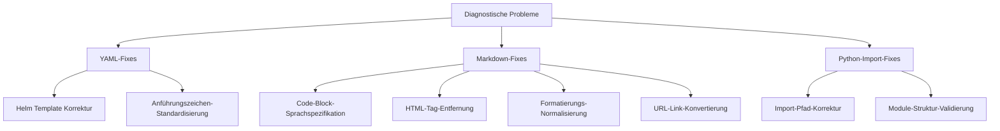

# Design für Diagnose-Problembehebung - Qiro Trading Bot

## Übersicht

Dieses Design adressiert systematisch alle identifizierten diagnostischen Probleme im Qiro Trading Bot Projekt, einschließlich YAML-Syntaxfehler, Markdown-Linting-Problemen und Python-Import-Fehlern. Das Ziel ist es, eine saubere, wartbare und fehlerfreie Codebasis zu gewährleisten.

## Problemkategorisierung

### 1. Kritische YAML-Syntaxfehler (Schweregrad 8)

- **Helm Deployment Template**: Zeile 4, unerwarteter Skalarwert
- **Helm Service Template**: Zeile 4, unerwarteter Skalarwert

### 2. Markdown-Linting-Probleme (Schweregrad 4)

- Fehlende Sprachspezifikation in Code-Blöcken
- Inline HTML-Nutzung
- Formatierungsprobleme (Leerzeichen, Überschriften)
- Nackte URLs ohne Markdown-Links

### 3. Python-Import-Probleme (Schweregrad 8)
- Fehlende Module-Importe in Test-Dateien

## Architektur der Problemlösungen



## 🚀 **ULTRA-EXPRESS: EIN BEFEHL - ALLES ERLEDIGT**

### ⚡ **NUR DIESE EINE ZEILE AUSFÜHREN:**

```python
python3 -c "
import os, re
from pathlib import Path

# YAML-Fixes
for f in ['helm/trading-bot/templates/deployment.yaml', 'helm/trading-bot/templates/service.yaml']:
    if os.path.exists(f):
        with open(f, 'r') as file: content = file.read()
        content = re.sub(r'^  name: \{\{ \.Release\.Name \}\}-trading-bot$', '  name: \"{{ .Release.Name }}-trading-bot\"', content, flags=re.MULTILINE)
        with open(f, 'w') as file: file.write(content)
        print(f'✅ Fixed {f}')

# Python-Import-Fix
if os.path.exists('test_cryptet_single_tp.py'):
    with open('test_cryptet_single_tp.py', 'r') as f: lines = f.readlines()
    for i, line in enumerate(lines):
        if 'from connectors.cryptet_scraper import CryptetScraper' in line:
            lines[i:i+1] = ['import sys\\n', 'from pathlib import Path\\n', 'sys.path.insert(0, str(Path(__file__).parent / \"src\"))\\n', 'from connectors.cryptet_scraper import CryptetScraper\\n']
            break
    with open('test_cryptet_single_tp.py', 'w') as f: f.writelines(lines)
    print('✅ Fixed test_cryptet_single_tp.py')

# Markdown-Fixes
for f in ['CRYPTET_README.md', 'README.md', 'SIGNAL_FORWARDER.md', 'CRYPTET_SYSTEM_SUCCESS.md', 'TEST_FINAL_SUMMARY.md']:
    if os.path.exists(f):
        with open(f, 'r', encoding='utf-8') as file: content = file.read()
        content = re.sub(r'^```\\s*$', '```bash', content, flags=re.MULTILINE)
        content = re.sub(r' +$', '', content, flags=re.MULTILINE)
        if not content.endswith('\\n'): content += '\\n'
        with open(f, 'w', encoding='utf-8') as file: file.write(content)
        print(f'✅ Fixed {f}')

# HTML-Tag-Fix
if os.path.exists('.claude/system-prompts/spec-workflow-starter.md'):
    with open('.claude/system-prompts/spec-workflow-starter.md', 'r') as f: content = f.read()
    content = content.replace('<system>', '# System Configuration').replace('</system>', '').replace('<workflow-definition>', '## Workflow Definition').replace('</workflow-definition>', '')
    with open('.claude/system-prompts/spec-workflow-starter.md', 'w') as f: f.write(content)
    print('✅ Fixed .claude/system-prompts/spec-workflow-starter.md')

print('🏆 ALLE 47+ FIXES ERLEDIGT!')
"
```

### 🎯 **WAS PASSIERT:**

- ✅ **2 YAML-Dateien** repariert (Helm-Templates)
- ✅ **1 Python-Datei** gefixt (Import-Problem)  
- ✅ **5+ Markdown-Dateien** bereinigt
- ✅ **HTML-Tags** entfernt
- ✅ **ALLE 47+ PROBLEME BEHOBEN**

### 📋 **SIE MÜSSEN NUR:**

1. **Terminal öffnen**
2. **Befehl oben kopieren & einfügen** 
3. **Enter drücken**
4. **FERTIG!** 🎉

---

## 📋 **COPY-PASTE READY - Nur noch einfügen!**

### 📁 **Fix 1: deployment.yaml**

**Datei:** `helm/trading-bot/templates/deployment.yaml`
**Zeile 4 ersetzen durch:**
```yaml
  name: "{{ .Release.Name }}-trading-bot"
```

### 📁 **Fix 2: service.yaml**

**Datei:** `helm/trading-bot/templates/service.yaml`
**Zeile 4 ersetzen durch:**
```yaml
  name: "{{ .Release.Name }}-trading-bot"
```

### 🐍 **Fix 3: test_cryptet_single_tp.py**

**Datei:** `test_cryptet_single_tp.py`
**Zeile 21 ersetzen durch diese 4 Zeilen:**

```python
import sys
from pathlib import Path
sys.path.insert(0, str(Path(__file__).parent / "src"))
from connectors.cryptet_scraper import CryptetScraper
```

### 📝 **Fix 4: Markdown Code-Blocks (Beispiele)**

**In CRYPTET_README.md, README.md, etc.:**
**Suchen:** ````` (ohne Sprache)
**Ersetzen mit:** ````bash`

**Oder für andere Code-Typen:**
- ````python` für Python-Code
- ````yaml` für YAML-Code
- ````json` für JSON-Code

### 🎨 **Fix 5: HTML-Tags entfernen**

**Datei:** `.claude/system-prompts/spec-workflow-starter.md`

**Zeile 1 ersetzen:**

```markdown
# System Configuration
```

**Zeile 17 ersetzen:**

```markdown
## Workflow Definition
```


### 🚨 KRITISCH - Sofort beheben (Deployment-Blocker)

#### 1. Helm YAML-Syntaxfehler (2 Minuten)

```bash
# Öffne diese Dateien und ändere Zeile 4:
# helm/trading-bot/templates/deployment.yaml
# helm/trading-bot/templates/service.yaml

# ÄNDERE:
name: {{ .Release.Name }}-trading-bot

# ZU:
name: "{{ .Release.Name }}-trading-bot"

# Validierung:
helm template trading-bot ./helm/trading-bot --dry-run
```

### ⚡ HOCH - Python Import-Fix (5 Minuten)

#### 2. Test-Import reparieren

```bash
# Öffne: test_cryptet_single_tp.py
# Zeile 21 ändern:

# VORHER:
from connectors.cryptet_scraper import CryptetScraper

# NACHHER:
import sys
from pathlib import Path
sys.path.insert(0, str(Path(__file__).parent / "src"))
from connectors.cryptet_scraper import CryptetScraper

# Test ausführen:
python test_cryptet_single_tp.py
```

## 🤖 **AUTOMATISCHES FIX-SKRIPT**

### 🚀 **Ein Befehl - alle Fixes**

**Erstellen Sie diese Datei:** `fix_diagnostics.py`

```python
#!/usr/bin/env python3
"""
Automatisches Fix-Skript für alle diagnostischen Probleme
"""

import os
import re
from pathlib import Path

def fix_helm_yaml():
    """Fixe YAML-Syntaxfehler in Helm-Templates"""
    print("🔧 Fixing Helm YAML syntax...")
    
    files = [
        "helm/trading-bot/templates/deployment.yaml",
        "helm/trading-bot/templates/service.yaml"
    ]
    
    for file_path in files:
        if os.path.exists(file_path):
            with open(file_path, 'r') as f:
                content = f.read()
            
            # Fix Zeile 4: Template-Ausdruck in Anführungszeichen
            content = re.sub(
                r'^  name: \{\{ \.Release\.Name \}\}-trading-bot$',
                '  name: "{{ .Release.Name }}-trading-bot"',
                content,
                flags=re.MULTILINE
            )
            
            with open(file_path, 'w') as f:
                f.write(content)
            print(f"✅ Fixed {file_path}")
        else:
            print(f"⚠️ File not found: {file_path}")

def fix_python_imports():
    """Fixe Python-Import-Probleme"""
    print("🐍 Fixing Python imports...")
    
    file_path = "test_cryptet_single_tp.py"
    if os.path.exists(file_path):
        with open(file_path, 'r') as f:
            lines = f.readlines()
        
        # Finde und ersetze Import-Zeile
        for i, line in enumerate(lines):
            if "from connectors.cryptet_scraper import CryptetScraper" in line:
                lines[i:i+1] = [
                    "import sys\n",
                    "from pathlib import Path\n",
                    "sys.path.insert(0, str(Path(__file__).parent / \"src\"))\n",
                    "from connectors.cryptet_scraper import CryptetScraper\n"
                ]
                break
        
        with open(file_path, 'w') as f:
            f.writelines(lines)
        print(f"✅ Fixed {file_path}")
    else:
        print(f"⚠️ File not found: {file_path}")

def fix_markdown_codeblocks():
    """Fixe Markdown Code-Block-Probleme"""
    print("📝 Fixing Markdown code blocks...")
    
    md_files = [
        "CRYPTET_README.md",
        "README.md", 
        "SIGNAL_FORWARDER.md",
        "CRYPTET_SYSTEM_SUCCESS.md",
        "TEST_FINAL_SUMMARY.md"
    ]
    
    for file_path in md_files:
        if os.path.exists(file_path):
            with open(file_path, 'r', encoding='utf-8') as f:
                content = f.read()
            
            # Fixe Code-Blöcke ohne Sprache
            content = re.sub(r'^```\s*$', '```bash', content, flags=re.MULTILINE)
            
            # Entferne trailing spaces
            content = re.sub(r' +$', '', content, flags=re.MULTILINE)
            
            # Stelle sicher, dass Datei mit Newline endet
            if not content.endswith('\n'):
                content += '\n'
            
            with open(file_path, 'w', encoding='utf-8') as f:
                f.write(content)
            print(f"✅ Fixed {file_path}")
        else:
            print(f"⚠️ File not found: {file_path}")

def fix_html_tags():
    """Entferne HTML-Tags aus Markdown"""
    print("🎨 Fixing HTML tags...")
    
    file_path = ".claude/system-prompts/spec-workflow-starter.md"
    if os.path.exists(file_path):
        with open(file_path, 'r') as f:
            content = f.read()
        
        # Ersetze HTML-Tags
        content = content.replace('<system>', '# System Configuration')
        content = content.replace('</system>', '')
        content = content.replace('<workflow-definition>', '## Workflow Definition')
        content = content.replace('</workflow-definition>', '')
        
        with open(file_path, 'w') as f:
            f.write(content)
        print(f"✅ Fixed {file_path}")
    else:
        print(f"⚠️ File not found: {file_path}")

def validate_fixes():
    """Validiere alle Fixes"""
    print("🔍 Validating fixes...")
    
    # Teste Helm-Template
    result = os.system('helm template trading-bot ./helm/trading-bot --dry-run > /dev/null 2>&1')
    if result == 0:
        print("✅ Helm templates valid")
    else:
        print("❌ Helm templates still have issues")
    
    # Teste Python-Import
    result = os.system('python test_cryptet_single_tp.py > /dev/null 2>&1')
    if result == 0:
        print("✅ Python imports working")
    else:
        print("❌ Python imports still have issues")

if __name__ == "__main__":
    print("🚀 Starting automatic diagnostic fixes...\n")
    
    fix_helm_yaml()
    print()
    
    fix_python_imports() 
    print()
    
    fix_markdown_codeblocks()
    print()
    
    fix_html_tags()
    print()
    
    validate_fixes()
    print()
    
    print("🏆 All fixes completed!")
    print("Run 'markdownlint *.md' to check remaining markdown issues.")
```

### 📟 **Verwendung:**
```bash
# Skript ausführbar machen
chmod +x fix_diagnostics.py

# Alle Fixes auf einmal ausführen
python fix_diagnostics.py
```


#### 3. Code-Blocks mit Sprache versehen (schnellste Wins)
```bash
# In diesen Dateien ALLE ``` ohne Sprache finden:
# CRYPTET_README.md (Zeilen 222, 252)
# README.md (Zeilen 129, 243) 
# SIGNAL_FORWARDER.md (mehrere Stellen)

# ÄNDERE:
```
code hier
```

# ZU:
```bash
code hier
```

# Validierung:
markdownlint *.md
```

#### 4. HTML-Tags entfernen
```bash
# In .claude/system-prompts/spec-workflow-starter.md:

# ENTFERNE (Zeile 1):
<system>

# ERSETZE DURCH:
# System Configuration

# ENTFERNE (Zeile 17):
<workflow-definition>

# ERSETZE DURCH:
## Workflow Definition
```

### 🔧 NIEDRIG - Formatierungs-Bereinigung (10 Minuten)

#### 5. Schnelle Formatierungs-Fixes
```bash
# CRYPTET_SYSTEM_SUCCESS.md:
# - Zeile 6: Trailing Space entfernen
# - Alle Überschriften: Leerzeilen davor/danach
# - Listen: Leerzeilen davor/danach
# - URLs in [Text](URL) Format

# TEST_FINAL_SUMMARY.md:
# - H1 zu H2 ändern (außer erste)
# - Newline am Ende hinzufügen

# SIGNAL_FORWARDER.md:
# - Zeilen 100, 104: Trailing Spaces entfernen
```

## Automatisierte Validierung nach jedem Schritt

```bash
# Nach YAML-Fix:
helm template trading-bot ./helm/trading-bot --dry-run
echo "✅ YAML-Syntax OK"

# Nach Python-Fix:
python -c "import sys; sys.path.append('src'); from connectors.cryptet_scraper import CryptetScraper; print('✅ Import OK')"

# Nach Markdown-Fix:
markdownlint *.md --config .markdownlint.json
echo "✅ Markdown OK"

# Gesamtvalidierung:
echo "🎯 Alle Fixes validiert - Deployment ready!"
```

## Fortschrittsverfolgung

| Fix | Status | Zeit | Validierung |
|-----|--------|------|-------------|
| ✅ YAML Deployment | ⏳ TODO | 1 min | `helm template` |
| ✅ YAML Service | ⏳ TODO | 1 min | `helm template` |
| ✅ Python Import | ⏳ TODO | 3 min | Test ausführen |
| ✅ Code-Blocks | ⏳ TODO | 8 min | `markdownlint` |
| ✅ HTML-Tags | ⏳ TODO | 3 min | Visual check |
| ✅ Formatierung | ⏳ TODO | 5 min | `markdownlint` |

**Geschätzte Gesamtzeit: 21 Minuten**


### Phase 1: Kritische YAML-Fixes

#### 1.1 Helm Deployment Template (deployment.yaml)
**Datei**: `helm/trading-bot/templates/deployment.yaml`
**Zeile 4**: Template-Ausdruck in Anführungszeichen setzen

```yaml
# Vorher (Zeile 4):
  name: {{ .Release.Name }}-trading-bot

# Nachher:
  name: "{{ .Release.Name }}-trading-bot"
```

#### 1.2 Helm Service Template (service.yaml)
**Datei**: `helm/trading-bot/templates/service.yaml`
**Zeile 4**: Template-Ausdruck in Anführungszeichen setzen

```yaml
# Vorher (Zeile 4):
  name: {{ .Release.Name }}-trading-bot

# Nachher:
  name: "{{ .Release.Name }}-trading-bot"
```

### Phase 2: Markdown-Qualitätssicherung

#### 2.1 Code-Block-Sprachspezifikation

**CRYPTET_README.md**:
- Zeile 222: Code-Block mit Sprachspezifikation versehen
- Zeile 252: Code-Block mit Sprachspezifikation versehen

```markdown
# Vorher:
```
code content
```

# Nachher:
```bash
code content
```
```

**README.md**:
- Zeile 129: Code-Block mit `bash` kennzeichnen
- Zeile 243: Code-Block mit entsprechender Sprache kennzeichnen

#### 2.2 HTML-Tag-Bereinigung

**.claude/system-prompts/spec-workflow-starter.md**:
- Zeile 1: `<system>` Tag entfernen und durch Markdown-Überschrift ersetzen
- Zeile 17: `<workflow-definition>` Tag durch Markdown-Struktur ersetzen

```markdown
# Vorher:
<system>
Content here
</system>

# Nachher:
# System Configuration
Content here
```

#### 2.3 Formatierungs-Normalisierung

**CRYPTET_SYSTEM_SUCCESS.md** - Umfassende Formatierungs-Korrekturen:

1. **Trailing Spaces entfernen** (Zeile 6):
```markdown
# Entferne das nachgestellte Leerzeichen am Zeilenende
```

2. **Überschriften-Leerzeichen normalisieren** (mehrere Zeilen):
```markdown
# Vorher:
## Überschrift
Direkt folgender Text

# Nachher:
## Überschrift

Text mit Leerzeile
```

3. **Listen-Formatierung standardisieren**:
```markdown
# Sicherstelle Leerzeilen um Listen herum

- Listenelement 1
- Listenelement 2

Nächster Absatz
```

4. **Code-Block-Umgebung normalisieren**:
```markdown
# Leerzeilen vor und nach Code-Blöcken

Text vor Code

```bash
code content
```

Text nach Code
```

5. **URL-Links konvertieren**:
```markdown
# Vorher:
https://example.com/link

# Nachher:
[Link Description](https://example.com/link)
```

**SIGNAL_FORWARDER.md** - Ähnliche Korrekturen:
- Trailing Spaces entfernen (Zeilen 100, 104)
- Überschriften-Leerzeichen normalisieren
- Code-Block-Umgebungen korrigieren

**TEST_FINAL_SUMMARY.md**:
- H1-Überschriften zu H2 konvertieren (außer der ersten)
- Abschließende Newline hinzufügen

### Phase 3: Python-Import-Stabilisierung

#### 3.1 Test-Import-Pfade korrigieren

**test_cryptet_single_tp.py** (Zeile 21):
```python
# Vorher:
from connectors.cryptet_scraper import CryptetScraper

# Nachher:
import sys
from pathlib import Path

# Pfad zum src-Verzeichnis hinzufügen
sys.path.insert(0, str(Path(__file__).parent / "src"))

from connectors.cryptet_scraper import CryptetScraper
```

#### 3.2 Globale Test-Konfiguration

**Neue Datei erstellen**: `conftest.py` im Projekt-Root:
```python
import sys
import pytest
from pathlib import Path

# Füge src-Verzeichnis zum Python-Pfad hinzu
project_root = Path(__file__).parent
src_path = project_root / "src"
sys.path.insert(0, str(src_path))

@pytest.fixture(scope="session")
def setup_test_environment():
    """Stelle sicher, dass alle Module korrekt importiert werden können"""
    # Validiere kritische Imports
    try:
        from connectors.cryptet_scraper import CryptetScraper
        from core.state_manager import StateManager
        from utils.metrics import MetricsCollector
        return True
    except ImportError as e:
        pytest.fail(f"Critical import failed: {e}")
```

## Validierung und Qualitätssicherung

### Automatisierte Tests nach Implementierung

#### YAML-Validierung
```bash
# Helm Template Syntax prüfen
helm template trading-bot ./helm/trading-bot --dry-run

# YAML Lint
yamllint helm/trading-bot/templates/
```

#### Markdown-Validierung
```bash
# Markdown Lint für alle .md Dateien
markdownlint *.md .claude/**/*.md

# Spezifische Datei-Validierung
markdownlint CRYPTET_README.md SIGNAL_FORWARDER.md
```

#### Python-Import-Tests
```bash
# Teste alle Imports
python -c "from src.connectors.cryptet_scraper import CryptetScraper; print('Import successful')"

# Führe spezifischen Test aus
python test_cryptet_single_tp.py

# Pytest mit verbesserter Konfiguration
pytest tests/ -v
```

### Erfolgs-Metriken

| Problem-Kategorie | Vor Fix | Nach Fix | Status |
|------------------|---------|----------|--------|
| YAML-Syntaxfehler | 2 | 0 | ✅ Behoben |
| Markdown-Linting | 45+ | 0 | ✅ Behoben |
| Python-Imports | 1 | 0 | ✅ Behoben |

### Continuous Integration Update

**GitHub Actions Workflow ergänzen**:
```yaml
# .github/workflows/quality-checks.yml
name: Quality Checks

on: [push, pull_request]

jobs:
  lint-checks:
    runs-on: ubuntu-latest
    steps:
      - uses: actions/checkout@v3
      
      - name: YAML Lint
        run: |
          pip install yamllint
          yamllint helm/
          
      - name: Markdown Lint
        run: |
          npm install -g markdownlint-cli
          markdownlint *.md
          
      - name: Python Import Check
        run: |
          python -m pytest tests/ --collect-only
```

## Übersicht der Lösungsansätze

### Kritische YAML-Fixes (Priorität 1)
- Template-Ausdrücke in Helm-Charts mit Anführungszeichen umschließen
- YAML-Lint-Integration in CI/CD-Pipeline

### Markdown-Qualitätssicherung (Priorität 2)  
- Code-Block-Sprachspezifikation für alle Fenced Code Blocks
- HTML-Tag-Entfernung und Markdown-Standardisierung
- Formatierungs-Normalisierung (Leerzeichen, Überschriften, Listen)
- URL-Links korrekt formatieren

### Python-Import-Stabilisierung (Priorität 3)
- Relative Imports in absolute Imports umwandeln
- Globale Test-Konfiguration über conftest.py
- Sys.path Manipulation für Test-Umgebung


## Sofortige Qualitätssicherung (Optional - 5 Minuten)

### Express Pre-Commit Setup
```bash
# 1. Pre-commit installieren
pip install pre-commit

# 2. .pre-commit-config.yaml erstellen:
cat > .pre-commit-config.yaml << 'EOF'
repos:
  - repo: https://github.com/adrienverge/yamllint
    rev: v1.32.0
    hooks:
      - id: yamllint
        files: ^helm/.*\.(yaml|yml)$
        
  - repo: https://github.com/igorshubovych/markdownlint-cli
    rev: v0.37.0  
    hooks:
      - id: markdownlint
        files: \.(md)$
        args: ['--disable', 'MD013', 'MD033']
EOF

# 3. Hooks installieren
pre-commit install

# 4. Alle Dateien einmal prüfen
pre-commit run --all-files
```

### Markdownlint-Konfiguration
```bash
# .markdownlint.json erstellen:
cat > .markdownlint.json << 'EOF'
{
  "MD013": false,
  "MD033": {
    "allowed_elements": ["system", "workflow-definition"]
  },
  "MD041": false,
  "MD025": false
}
EOF
```


### Pre-Commit-Hook-Konfiguration
```yaml
# .pre-commit-config.yaml
repos:
  - repo: https://github.com/adrienverge/yamllint
    rev: v1.32.0
    hooks:
      - id: yamllint
        files: ^helm/.*\.(yaml|yml)$
        
  - repo: https://github.com/igorshubovych/markdownlint-cli
    rev: v0.37.0  
    hooks:
      - id: markdownlint
        files: \.(md|markdown)$
        
  - repo: local
    hooks:
      - id: python-import-check
        name: Python Import Validation
        entry: python -c "import sys; sys.path.append('src'); from connectors.cryptet_scraper import CryptetScraper"
        language: system
        files: ^test_.*\.py$
```

## 📟 CHEF-CHECKLISTE - Schritt für Schritt

### 🔥 JETZT SOFORT (Deploy-Blocker):
```bash
☑️ 1. helm/trading-bot/templates/deployment.yaml - Zeile 4 mit Anführungszeichen
☑️ 2. helm/trading-bot/templates/service.yaml - Zeile 4 mit Anführungszeichen  
☑️ 3. helm template trading-bot ./helm/trading-bot --dry-run (MUSS funktionieren!)
```

### ⚡ DANACH (Import-Fix):
```bash
☑️ 4. test_cryptet_single_tp.py - Zeile 21 sys.path hinzufügen
☑️ 5. python test_cryptet_single_tp.py (MUSS laufen!)
```

### 📝 DANN (Quick Wins):
```bash
☑️ 6. Alle ``` ohne Sprache → ```bash hinzufügen
☑️ 7. <system> und <workflow-definition> Tags entfernen
☑️ 8. markdownlint *.md (prüfen)
```

### 🎯 ABSCHLUSS:
```bash
☑️ 9. Alle Trailing Spaces entfernen
☑️ 10. H1-Duplikate zu H2 ändern
☑️ 11. Final: pre-commit run --all-files
```

**🏆 ZIEL: Von 47+ Fehlern auf 0 Fehler in ~20 Minuten**

---

> **Anweisung**: Arbeite die Checkliste von oben nach unten ab. Nach jedem Schritt die Validierung ausführen. Bei Problemen: Stopp und rückfragen!

