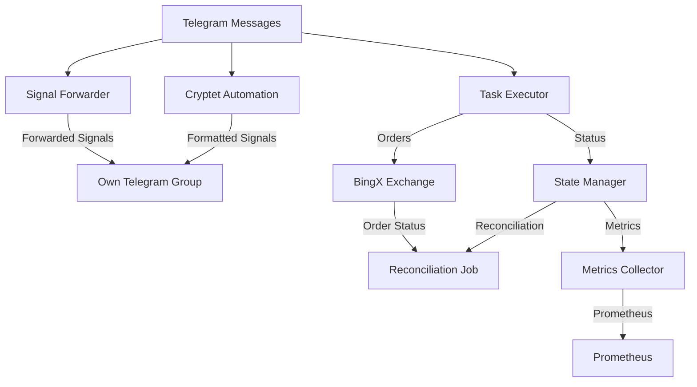
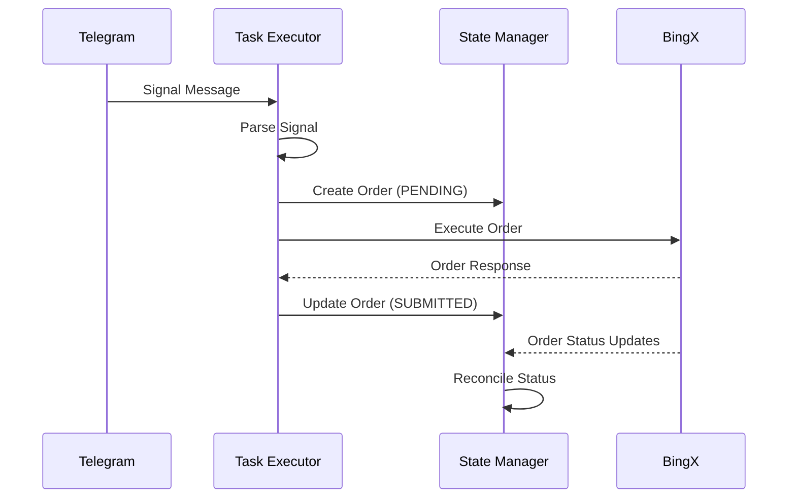
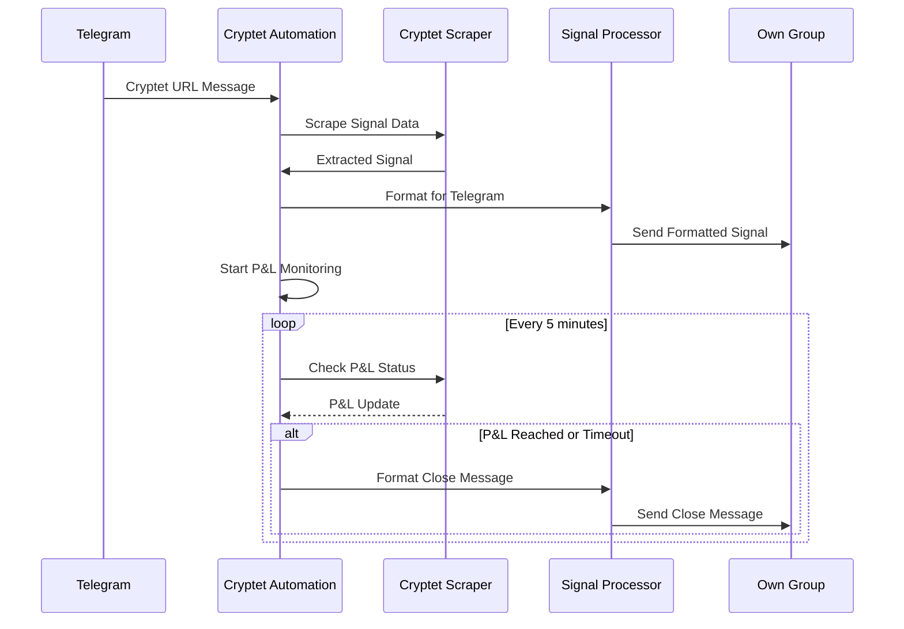
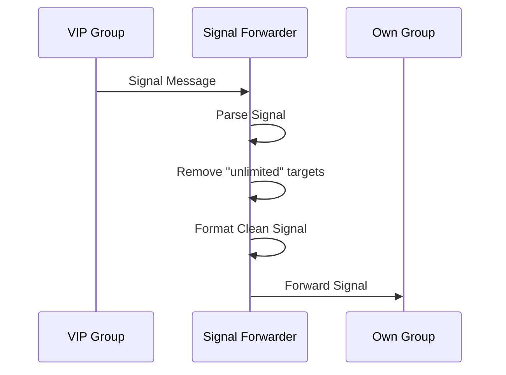

# 📡 Signal Processing Workflows & Formats

## 📋 Overview

This document details the signal processing workflows, message formats, and data flows within the Trading Bot system. It covers both manual signal processing and automated workflows from Cryptet and Telegram sources.

---

## 🔄 System Architecture

### High-Level Data Flow



---

## 📱 Telegram Signal Processing

### Signal Detection Workflow

#### Step 1: Message Reception
- Telegram messages received via Telethon connector
- Messages processed by message handler in [`src/main.py`](src/main.py:212)

#### Step 2: Chat Identification
```python
# Chat ID normalization logic
if chat_id == 2299206473 or chat_id == -1002299206473:
    normalized_chat_id = -1002299206473  # VIP Group
elif chat_id == 1804143400 or chat_id == -1001804143400:
    normalized_chat_id = -1001804143400  # Cryptet Channel
```

#### Step 3: Signal Routing
- **VIP Group (-1002299206473)**: Forward to Signal Forwarder
- **Cryptet Channel (-1001804143400)**: Process via Cryptet Automation
- **Other chats**: Process as standard trading signals

---

## 📊 Signal Formats

### 1. Simple Format
**Pattern**: `ACTION SYMBOL QUANTITY`

**Examples**:
```
BUY BTCUSDT 0.1
SELL ETHUSDT 0.5
LONG XRPUSDT 100
SHORT ADAUSDT 50
```

**Parsing Logic** ([`src/core/task_executor.py`](src/core/task_executor.py:112)):
```python
def _parse_simple_signal(message: str):
    parts = message.strip().split()
    if len(parts) != 3:
        return None
    
    action, symbol, quantity = parts
    if action.upper() not in ['BUY', 'SELL', 'LONG', 'SHORT']:
        return None
    
    try:
        quantity = float(quantity)
        return {
            'action': action.upper(),
            'symbol': symbol.upper(),
            'quantity': quantity
        }
    except ValueError:
        return None
```

### 2. Advanced Format (Cornix-compatible)
**Multi-line format with structured data**:

```
🟢 Long
Name: BTC/USDT
Margin mode: Cross (50X)

↪️ Entry price(USDT):
45000.00

Targets(USDT):
1) 46000.00
2) 47000.00
3) 48000.00
```

**Parsing Logic** ([`src/core/signal_forwarder.py`](src/core/signal_forwarder.py:143)):
```python
def _parse_signal(message: str):
    lines = message.strip().split('\n')
    signal_data = {}
    
    # Extract direction and symbol
    if lines[0].startswith('🟢'):
        signal_data['direction'] = 'LONG'
    elif lines[0].startswith('🔴'):
        signal_data['direction'] = 'SHORT'
    
    # Extract symbol from "Name: SYMBOL"
    for line in lines:
        if line.startswith('Name:'):
            signal_data['symbol'] = line.split(':', 1)[1].strip()
    
    # Extract entry price
    for i, line in enumerate(lines):
        if 'Entry price' in line and i + 1 < len(lines):
            signal_data['entry_price'] = lines[i + 1].strip()
    
    # Extract targets
    targets = []
    for i, line in enumerate(lines):
        if 'Targets' in line:
            j = i + 1
            while j < len(lines) and lines[j].strip() and not lines[j].startswith('#'):
                if ')' in lines[j]:
                    target = lines[j].split(')', 1)[1].strip()
                    targets.append(target)
                j += 1
            signal_data['targets'] = targets
            break
    
    return signal_data
```

### 3. Cryptet Signal Format
**Extracted from Cryptet website via browser automation**:

```json
{
  "symbol": "BTC/USDT",
  "direction": "LONG",
  "entry_price": "45000.00",
  "targets": ["46000.00", "47000.00"],
  "stop_loss": "44000.00",
  "leverage": 50,
  "source_url": "https://cryptet.com/signal/1234567890"
}
```

---

## 🚀 Signal Processing Workflows

### Workflow 1: Standard Signal Processing



### Workflow 2: Cryptet Automation



### Workflow 3: Signal Forwarding



---

## 🔧 Signal Processing Components

### 1. Task Executor ([`src/core/task_executor.py`](src/core/task_executor.py))
- **Function**: Processes simple trading signals
- **Features**: 
  - Circuit breaker pattern
  - Idempotent order execution
  - Retry logic with exponential backoff

### 2. Signal Forwarder ([`src/core/signal_forwarder.py`](src/core/signal_forwarder.py))
- **Function**: Forwards signals from VIP group to own group
- **Features**:
  - Advanced signal parsing
  - Target filtering (removes "unlimited")
  - Clean formatting

### 3. Cryptet Automation ([`src/core/cryptet_automation.py`](src/core/cryptet_automation.py))
- **Function**: Automates Cryptet signal processing
- **Features**:
  - Browser automation with Selenium
  - Cookie-based authentication
  - P&L monitoring
  - Automatic signal closing

### 4. Cryptet Scraper ([`src/connectors/cryptet_scraper.py`](src/connectors/cryptet_scraper.py))
- **Function**: Web scraping for Cryptet signals
- **Features**:
  - BeautifulSoup parsing
  - Regex pattern matching
  - Error handling and retries

---

## 📈 Signal Data Structure

### Common Signal Fields

| Field | Type | Description | Example |
|-------|------|-------------|---------|
| `symbol` | string | Trading pair | `"BTC/USDT"` |
| `direction` | string | Trade direction | `"LONG"`, `"SHORT"` |
| `entry_price` | string | Entry price | `"45000.00"` |
| `targets` | list | Take profit levels | `["46000.00", "47000.00"]` |
| `stop_loss` | string | Stop loss price | `"44000.00"` |
| `leverage` | int | Leverage multiplier | `50` |
| `quantity` | float | Trade quantity | `0.1` |
| `source` | string | Signal source | `"telegram"`, `"cryptet"` |

### Database Schema ([`src/core/state_manager.py`](src/core/state_manager.py))

```python
class Order(Base):
    __tablename__ = 'orders'
    
    id = Column(String, primary_key=True)
    symbol = Column(String)
    direction = Column(String)
    quantity = Column(Float)
    status = Column(String)  # PENDING, SUBMITTED, FILLED, CANCELLED
    created_at = Column(DateTime)
    updated_at = Column(DateTime)
```

---

## 🎯 Signal Validation & Transformation

### Validation Rules

1. **Symbol Validation**:
   - Must be valid trading pair format (e.g., BTC/USDT)
   - Must be supported by configured exchanges

2. **Price Validation**:
   - Entry price must be positive number
   - Targets must be higher than entry for LONG
   - Targets must be lower than entry for SHORT

3. **Quantity Validation**:
   - Must be positive number
   - Must not exceed position limits

### Transformation Logic

#### Leverage Addition ([`src/core/cryptet_signal_parser.py`](src/core/cryptet_signal_parser.py:144))
```python
def add_leverage_to_signal(signal_data, leverage=50):
    """Add leverage to signal and format for Cornix"""
    if 'margin_mode' not in signal_data:
        signal_data['margin_mode'] = f"Cross ({leverage}X)"
    return signal_data
```

#### Target Cleaning ([`src/core/signal_forwarder.py`](src/core/signal_forwarder.py:244))
```python
def _format_signal(signal_data):
    """Remove 'unlimited' targets and clean formatting"""
    # Filter out unlimited targets
    clean_targets = [
        target for target in signal_data.get('targets', [])
        if 'unlimited' not in target.lower()
    ]
    
    # Format with proper numbering
    formatted_targets = []
    for i, target in enumerate(clean_targets, 1):
        formatted_targets.append(f"{i}) {target}")
    
    signal_data['targets'] = formatted_targets
    return signal_data
```

---

## ⚡ Performance Considerations

### Processing Latency Targets
- **Signal to Order**: <2 seconds (p95)
- **Throughput**: 10 orders/second
- **Availability**: 99.9%

### Optimization Techniques
1. **Async Processing**: All components use async/await
2. **Connection Pooling**: Database and API connections reused
3. **Bulk Operations**: Where possible
4. **Efficient Parsing**: Regex and string operations optimized
5. **Caching**: Price and signal data cached appropriately

---

## 🔍 Debugging & Logging

### Key Log Events

#### Signal Reception
```json
{
  "timestamp": "2024-01-01T12:00:00Z",
  "level": "INFO",
  "event_type": "signal_received",
  "data": {
    "message": "BUY BTCUSDT 0.1",
    "chat_id": -1001234567890,
    "source": "telegram"
  }
}
```

#### Signal Processing
```json
{
  "timestamp": "2024-01-01T12:00:01Z",
  "level": "INFO",
  "event_type": "order_created",
  "data": {
    "order_id": "order_123",
    "symbol": "BTCUSDT",
    "quantity": 0.1,
    "status": "PENDING"
  }
}
```

#### Cryptet Processing
```json
{
  "timestamp": "2024-01-01T12:00:00Z",
  "level": "INFO",
  "event_type": "cryptet_signal_processed",
  "data": {
    "url": "https://cryptet.com/signal/123",
    "symbol": "BTC/USDT",
    "success": true
  }
}
```

---

## 🧪 Testing Signals

### Test Endpoints

#### Manual Signal Test
```bash
curl -X POST http://localhost:8080/signal \
  -H "Content-Type: application/json" \
  -d '{
    "message": "BUY BTCUSDT 0.1",
    "metadata": {
      "source": "test",
      "chat_id": 123,
      "message_id": 456
    }
  }'
```

#### Cryptet Link Test
```bash
curl -X POST http://localhost:8080/cryptet/test \
  -H "Content-Type: application/json" \
  -d '{"url": "https://cryptet.com/signal/1234567890"}'
```

### Test Data Examples

#### Valid Test Signals
```python
# Simple format
test_signals = [
    "BUY BTCUSDT 0.1",
    "SELL ETHUSDT 0.5",
    "LONG XRPUSDT 100",
    "SHORT ADAUSDT 50"
]

# Advanced format
advanced_signal = """
🟢 Long
Name: BTC/USDT
Margin mode: Cross (50X)

↪️ Entry price(USDT):
45000.00

Targets(USDT):
1) 46000.00
2) 47000.00
"""
```

#### Invalid Test Signals
```python
invalid_signals = [
    "BUY BTCUSDT",  # Missing quantity
    "TRADE ETHUSDT 0.5",  # Invalid action
    "BUY INVALID 0.1",  # Invalid symbol
    "BUY BTCUSDT abc"  # Invalid quantity
]
```

---

## ⚠️ Common Issues & Solutions

### 1. Signal Not Parsed
**Issue**: Message not recognized as signal  
**Solution**: Check signal format and parsing rules

### 2. Cryptet Scraping Fails  
**Issue**: Cannot extract signal data from Cryptet  
**Solution**: Verify cookies, check website structure changes

### 3. Order Execution Fails
**Issue**: Orders not reaching exchange  
**Solution**: Check API keys, exchange connectivity

### 4. Signal Formatting Issues
**Issue**: Formatted signal looks incorrect  
**Solution**: Review formatting logic and target cleaning

---

## 📋 Best Practices

1. **Signal Validation**: Always validate signals before processing
2. **Error Handling**: Implement robust error handling for all components
3. **Logging**: Log all signal processing steps for debugging
4. **Monitoring**: Monitor processing latency and success rates
5. **Testing**: Regularly test with sample signals
6. **Security**: Never log sensitive data like API keys or order details

**Remember**: Always test signal processing in a safe environment before live trading!